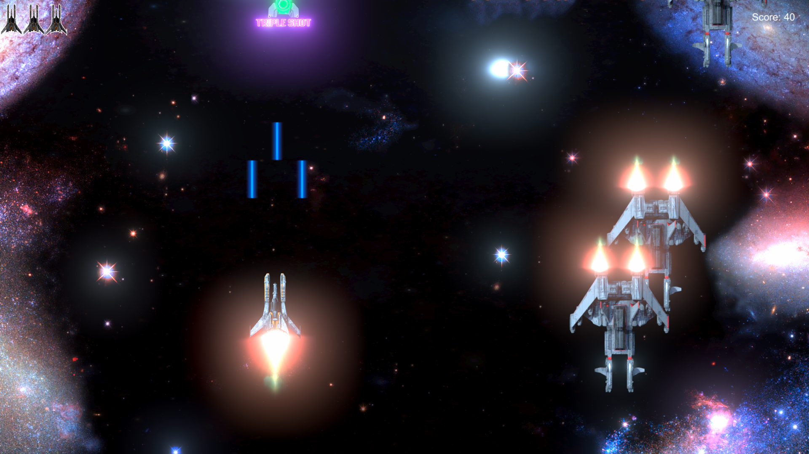

<h2><b>Galaxy Shooter</b></h2>  

Galaxy Shooter is a simple 2D shooter.
It was made using the Unity engine in C#. It uses various concepts like collision detection, background overlays and basic animations in unity2d.
The game features retro background music and animations.

<h3>Controls:</h3> 
Movement: WSAD / Arrow Keys 
Fire: Left Click/ Spacebar 
 

<h3><b>Screenshots</b></h3>
 

 

 

 

 

